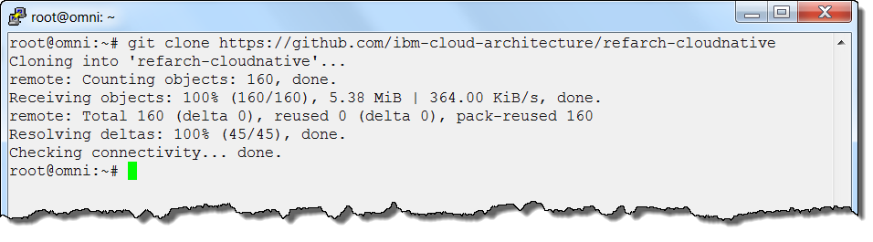
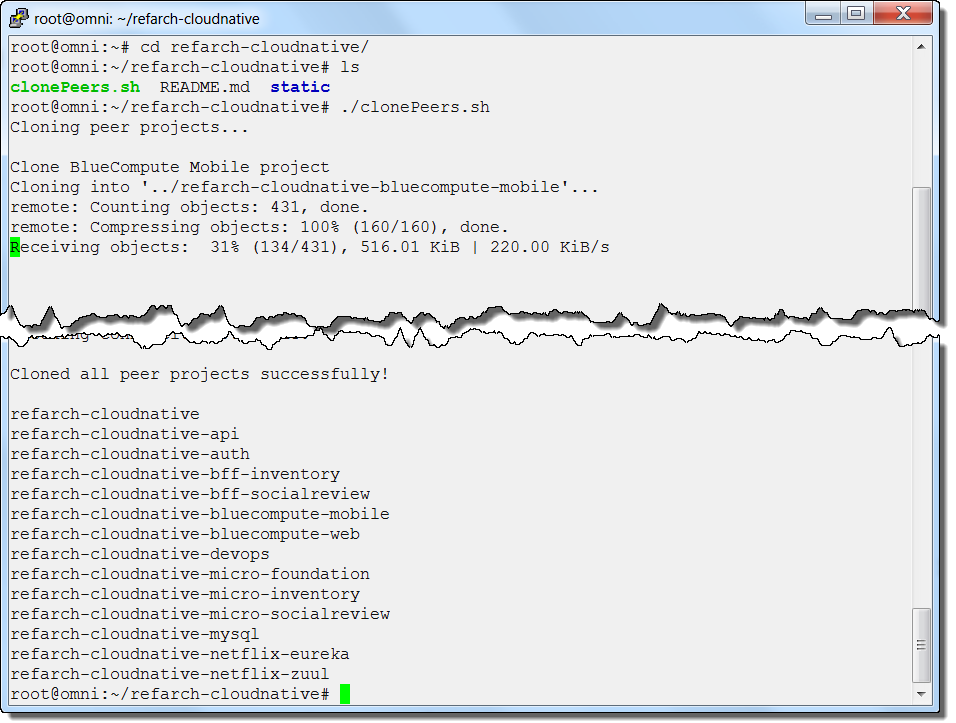

# Unit 0: Preparation

Before you run the exercises, make sure that you have the proper environment setup. This preparation section describes how to download, extract and initialize the virtual machine that you will use for your local environment, and how to verify connectivity and software so your environment is ready for the rest of the exercises. 

## Exercise 1: Loading the VM 

The lab exercises are designed to run from a virtual machine running ubuntu Linux. The instructions are very specific to run in this Linux environment and involve deploying parts of the BlueCompute application to your own Bluemix account. The BlueCompute github readme files provide additional background information beyond what is contained in our lab exercise documents. All git readme files are cross linked from `https://github.com/ibm-cloud-architecture/refarch-cloudnative`.

Follow these steps:

1. The VM image can be downloaded from `http://tinyurl.com/zwkkb7b`or using Aspera from `https://ibm-clouddemos.asperafiles.com/public/files?token=c4YJAgGUV9nRorPpKDLS3b3viS6Qhg-89__fyoN7S4w`. There are 2 versions of the VM image, one for VMware and one for VirtualBox. Other than the hypervisor, they are identical. Each image is around 1.5GB. Download the appropriate image for your hypervisor.

2. Extract the file using 7z (`http://www.7-zip.org`) using the command:

        7z x microservices_vmware.7z or 7z x microservices_virtualbox.7z

3. Open and start the VMware image using VMware Workstation or VMware Player, or the VirtualBox image using VirtualBox.

4. Once the VM is finished loading, login as `bmxuser` with the password of `passw0rd`.

5. Verify that your VM has an IP address using the `ip a` command

6. Check internet connectivity by entering a command such as `ping www.ibm.com`. You can break out of the ping command with `Ctrl-C`. If you are not seeing a working network connection, work with your instructor to solve the problem before proceeding.

7. When you work through the exercises, it is recommended to use an ssh connection to the virtual machine, rather than just using the hypervisor console. Using an ssh connection, you are able to copy and paste the command line, a useful capability for some of the long commands you will be entering. You can use the PuTTY application if you have it installed, or any other ssh client product. If you are working on a Mac, you can also use the `ssh` command directly from a terminal window. The VM has a NAT network interface. If you are using the VMware image, ssh to the IP address of the `ens33` network adapter returned by the `ip a` command from the previous step. If you are using the VirtualBox image, ssh to the loopback address 127.0.0.1 on port 2222. Port forwarding has been configured to redirect you to the VM image. 

## Exercise 2: Checking Pre-installed software in your VM Image

Since we have limited time, and the goal is to teach you about microservices rather than how to set up your local development environment, the instructions here are very specific to the Ubuntu Linux environment in your virtual machine and for deploying the selected parts of the BlueCompute application in your own Bluemix account. 

In this exercise, you to explore and verify the software that has been pre-installed for you in the VM for your local development environment. The versions of the software are not important. We are just checking to verify that the software is installed.

1. Check that you have Java Development Kit installed and set in your PATH. 

         echo $JAVA_HOME
         echo $PATH
         java -version

2. Check that you have GIT.

         git --version
         
3. Check that you have curl. 

         curl -V
         
4. Check that you have node.js. 

         node -v
         npm version

5. Check that the API Connect command line toolkit is installed.

         apic -v
         
5. Check that you have docker installed. 

         docker version
         
6. Check that you have the Cloud Foundry command line interface installed.

         cf version
         
## Exercise 3: Cloning GIT Repositories and Preparing for the Lab Exercises

1. Enter the `cd` command with no parameters to take you to your home directory.

        cd 
2. Clone the master repository. This command downloads the main directory of code and instructions for the Blue Compute application.

        git clone https://github.com/ibm-cloud-architecture/refarch-cloudnative

3. Clone the rest of the repositories. The shell script downloads directories of code and instructions for each of the Blue Compute components that you will be implementing in the lab exercises to follow.

        cd refarch-cloudnative
        ./clonePeers.sh

   Each of these repositories contains the code and instructions for one of the components of the Blue Compute microservices application. Because of time constraints, you will only be implementing a subset of these components. The rest of the components are already running for you in Bluemix. You will share these components with the rest of your lab participants. This illustrates the flexibility of microservices. Each microservice component is independent of the others, and is not dependent on or affected by the status of the others. 

4. Even though the "home" region of your Bluemix account might be Europe or Asia, for these exercises you will use the US South region. If you have never worked in the US South region before, log in to your Bluemix account from a web browser and change your region (upper right corner) to US South. Make sure you have an organization in this region. It is also recommended to create a new space in your organization for this set of exercises. You can name your space as you wish, but `bluecompute` or `cloudnative` are good suggestions. 
5. In your virtual machine, login to Bluemix from the cloudfoundry command line and initialize the IBM Containers plugin

        cf login -a <apihost> -u <IBMid> -o <org> -s <space>
        
    If you prefer, you can just enter `cf login` and be prompted for the additional parameters. The API host parameter for the North America region is `api.ng.bluemix.net`.

5. See the IBM Containers plug-in version that you are running, and get your IBM Containers namespace.

        cf ic init
        cf ic login
        cf ic version
        cf ic namespace get
        
   If you do not get the namespace returned, then you must define one using the `cf ic namespace set <name>` command. Remember that this namespace name cannot be changed afterwards and becomes the namespace for all images and containers in your organization. 

