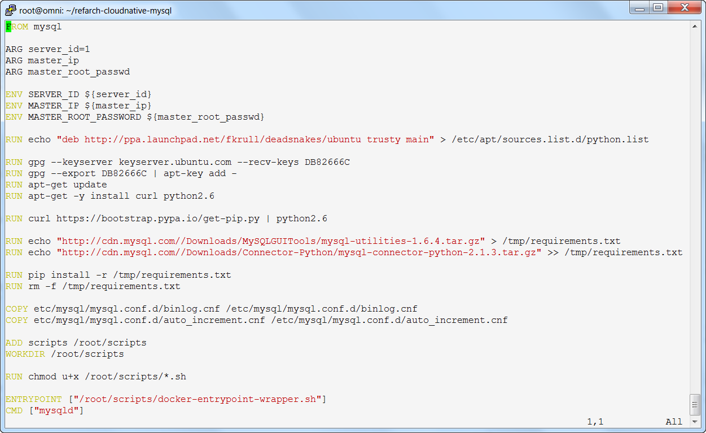

# Unit 2: Deploying the Inventory microservice

This unit exercise walks you though the deployment of the Inventory microservice application and explains how it works. The Inventory microservice is deployed in a container. The MySQL database it uses is deployed in a separate container. In this unit, you will build each of these containers in your local environment, push them to the IBM Containers registry in Bluemix, start them and test them. The steps here are based on those in `https://github.com/ibm-cloud-architecture/refarch-cloudnative-micro-inventory`.

## Exercise 1: Deploying MySQL database
The MySQL database runs in a separate container from the Inventory microservice that uses it. In a real-world microservices implementation, the database for an application could run in the Enterprise datacenter as an on-premises resource that would be accessed through the Secure Gateway. However in this setup, you will connect the Inventory microservice container directly to the MySQL container.

The following steps are modified from the original instructions in  `https://github.com/ibm-cloud-architecture/refarch-cloudnative-mysql/README.md` to accommodate the use of a suffix added to the name of each resource. The URLs for each of the resources you will deploy to Bluemix need to be unique. To make it easier to keep track of these names, we recommend that you use the same suffix for the names of the corresponding resources as you build them in your local environment. These instructions follow that practice. Think of a suffix that you can use for your resources, and use it consistently throughout these exercises. 

 Throughout these instructions, you use the US South Bluemix region. 

As you go through these exercises, you will not be deploying all of the microservice components of the Blue Compute application. The components that you deploy will connect with a shared set of components that are already implemented for you. These shared components all use the suffix "-garage", as you will see throughout the rest of the instructions.

1. Make sure that you are already logged in to Bluemix and initialize the container plugin.

        cf login -a api.ng.bluemix.net -u <IBMid> -p <IBMpw>
        cf ic init
   Make sure that you have no error on these commands. If you have never used the Container service then you must define a container namespace. This namespace must be unique and cannot be changed for the Bluemix org that you are connected to. To set the namespace, run the command `cf ic namespace set <namespace>`.

2. Look at the process to build the mysql container

        cd ~/refarch-cloudnative-mysql
        vi Dockerfile

The Dockerfile is a script that builds a Docker image. It can do things such as pulling standard images from DockerHub to use as a base, installing additional software, adding files, and doing other configuration. This is a summary of what this Dockerfile is doing:
   -  Uses the standard mysql container from DockerHub as a base image
   -  Uses server\_id, master\_ip and master\_root\_password (which are used to create a replication cluster for resiliency; these values can be ignored in this single instance environment)
   -  Installs curl and python 2.6
   -  Installs mysql python connector and mysql utilities
   -  Loads scripts, sets default path and sets file permissions
   -  Specifies to initialize the container using docker-entrypoint-wrapper.sh and run mysqld

You must make a change to the Dockerfile, based on an updated version of software products since its creation. Make the following changes:
   - Change the first line in the file to `FROM mysql:5.7.16`
   
2. Build the docker image using the Dockerfile. Note that there is a dot at the end of the `docker build` command.

        docker build -t mysql-<SUFFIX> .
The result of your `docker build` command should be the message `Successfully built <container id>`. If you have a different message, check your changes to the Dockerfile and run your `docker build` command again.

3. Tag and push the mysql database container to the IBM Containers registry in Bluemix. Make sure you use your suffix to make your container names unique. You also use your namespace in these commands. If you don't know your namespace, you can see it in the result of the command `cf ic namespace get`.

        docker tag mysql-<SUFFIX> registry.ng.bluemix.net/<NAMESPACE>/mysql-<SUFFIX>
        docker push registry.ng.bluemix.net/<NAMESPACE>/mysql-<SUFFIX>

After the `docker push` command is complete, you can check to make sure your image is on Bluemix with the command `cf ic images`. You should see mysql-<SUFFIX> in the list.

4. Start the MySQL container for database `inventorydb`. This database can be connected on port 3306 to the container as `dbuser` using `Pass4dbUs3R`. This command should be entered as a single command line.

        cf ic run -m 128 --name mysql-<SUFFIX> -p 3306:3306 -e MYSQL_ROOT_PASSWORD=Pass4Admin123 -e MYSQL_USER=dbuser -e MYSQL_PASSWORD=Pass4dbUs3R -e MYSQL_DATABASE=inventorydb registry.ng.bluemix.net/<NAMESPACE>/mysql-<SUFFIX>

5. Use the `cf ic ps` command to verify that your MySQL container has been started on Bluemix and is still running. If you cannout see your container in the list, enter the above command again.

6. Create the `items` table and load the sample data. You should see the message _Data loaded to inventorydb.items._ Verify that there are 12 rows in the table. Notice that there is no space in the `-u` and `-p` parameters of the `mysql` command.

        cf ic exec -it mysql-<SUFFIX> sh load-data.sh
	    cf ic exec -it mysql-<SUFFIX> bash
	    root@instance-823719832> mysql -u${MYSQL_USER} -p${MYSQL_PASSWORD} ${MYSQL_DATABASE}
	    mysql> 9
	    mysql> quit
	    root@instance-823719832> exit

The Inventory database `inventorydb` is now ready in its IBM Container on Bluemix.  

## Exercise 2: Deploying the Inventory microservice
The inventory microservice is a Java application based on Spring framework and is run in an IBM Container on Bluemix. The instructions here are based on `https://github.com/ibm-cloud-architecture/refarch-cloudnative-micro-inventory/README.md`.  

1. Explore the application. First look into the configuration file, `src/main/resources/application.yml`. As with any Spring framework based application, this is where the configuration is stored.

        cd ~/refarch-cloudnative-micro-inventory
        vi src/main/resources/application.yml

   The important configuration options are:
   - eureka.client.serviceUrl.defaultZone
   - server.context-path
   - spring.datasource.url
   - spring.datasource.username
   - spring.datasource.password

    These options are used to configure necessary parameters for the application. We will not change any of these settings now. As you will see, each of these parameters can be overridden from the command line when the container is started. That is what we will do.

2. Build the application. The build result is stored in `build/libs/micro-inventory-0.0.1.jar`. This is the file that is used by the microservice.

        ./gradlew build

3. Look at the Dockerfile.

        vi docker/Dockerfile

   The Dockerfile is similar to the mysql one, except that it adds the installation of the New Relic agent. New Relic is a Java performance monitoring tool with low overhead. You may also notice that it adds a file to the container called app.jar. This file must be in the same directory as the Dockerfile for the Dockerfile to run successfully. We will copy the jar file from our build to app.jar in the docker subdirectory, then build the container image.

4. Build the docker container image. Note that there is a dot at the end of the `docker build` command.

        cp build/libs/micro-inventory-0.0.1.jar docker/app.jar
        cd docker
        docker build -t inventoryservice-<SUFFIX> .

5. Tag and push the local docker image to the Bluemix private registry. 

        docker tag inventoryservice-<SUFFIX> registry.ng.bluemix.net/<NAMESPACE>/inventoryservice-<SUFFIX>
        docker push registry.ng.bluemix.net/<NAMESPACE>/inventoryservice-<SUFFIX>

6. Get the private IP address of the database container.

        cf ic inspect mysql-<SUFFIX> | grep -i ipaddress

7. Start the application in IBM Containers in Bluemix. This application will actually be run as a container group, a feature of IBM Containers for scalability and resiliency. Replace `<ipaddr>` with the private IP address of the database container. This command should also entered on a single command line.

        cf ic group create -p 8080 -m 256 --min 1 --desired 1 \
         --auto --name micro-inventory-group-<SUFFIX> \
         -e "spring.datasource.url=jdbc:mysql://<ipaddr>:3306/inventorydb" \
         -e "eureka.client.serviceUrl.defaultZone=http://netflix-eureka-garage.mybluemix.net/eureka/" \
         -e "spring.datasource.username=dbuser" \
         -e "spring.datasource.password=Pass4dbUs3R" \
         -n inventoryservice-<SUFFIX> -d mybluemix.net \
         registry.ng.bluemix.net/<NAMESPACE>/inventoryservice-<SUFFIX>

8. Use the command `cf ic group list` to track the progress of the container group creation. It will take several minutes to complete. Wait until the status is `CREATE_COMPLETE` before continuing to the next step.

9. Validate the inventory service.

        curl http://inventoryservice-<SUFFIX>.mybluemix.net/micro/inventory/13402

10. Open the Eureka interface for the registered endpoints. Go to `http://netflix-eureka-garage.mybluemix.net/` in a browser and check for the registered application.

## Exercise 2: Understanding the Inventory Spring Framework Java Application

1. This is a short description of the Inventory Java program that uses the Spring framework. The source is located under src/main/java. The application uses the Java package called inventory.mysql and has a structure similar to:

   - Application: the main program that loads spring
   - InventoryController: the logic for URL mappings
   - models/IInventoryRepo: uses CrudController that allows encapsulation of data into API
   - models/Inventory: class that is used to map individual data item's fields
2. The main logic that controls the API is provided in InventoryController.java.

   The interface is quite simple. Based on the prefix in the application.yml (`/micro`) and the @RequestMapping directive, you can see that
`http://inventoryservice-<SUFFIX>.mybluemix.net/micro/check` will return `It works!` as its reply.

3. The social review microservice is one of the components that has already been implemented for you in the shared environment. Check the social review microservice in the shared environment. It should return a JSON array that is delimited with square brackets (the array may be empty []). Remember that all the pre-deployed shared microservice components use a suffix of "-garage".

    `http://socialreviewservice-garage.mybluemix.net/micro/review`   
