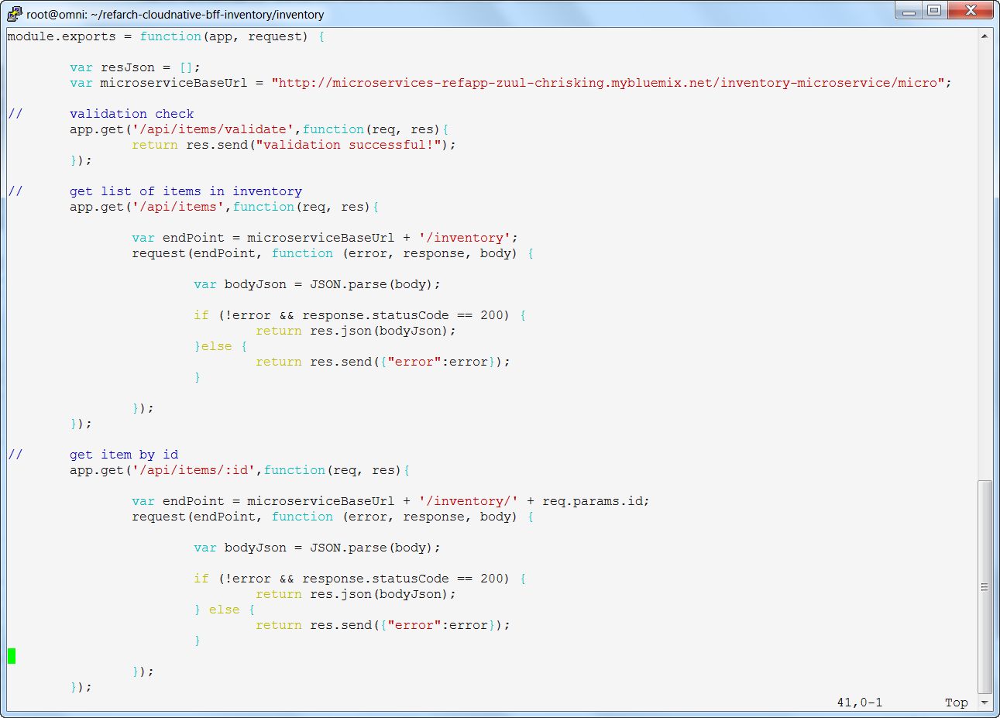
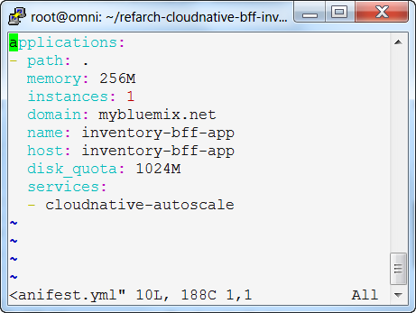
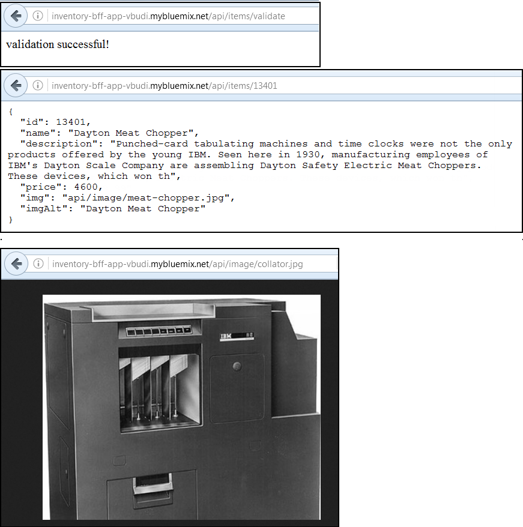

# Unit 4: Working with the Inventory BFF Cloud Foundry Application

In this unit, you will be configuring and deploying the inventory Backend for Frontend (BFF) application. This application acts as a front-end proxy for the actual inventory microservice application that you just deployed. Backend for Frontend (BFF) applications are typically implemented as placeholders while the actual back-end applications are being developed. They can be used to validate any functions in the front-end application before the back-end is ready. Eventually, when the back-end application is ready,  the front-end can be used as a service proxy or another abstraction layer. The steps here are based on `https://github.com/ibm-cloud-architecture/refarch-cloudnative-bff-inventory`.

## Exercise 1: Exploring the Inventory BFF application 

As opposed to the Inventory microservice application that was written in Java and deployed in a container, this application is written in Node.js and is deployed as a Cloud Foundry application. It acts as a proxy between API Connect and the Inventory microservice application. You will configure API Connect in a later exercise. 

Follow these instructions to explore and configure the Inventory BFF application.

1. First, let's explore how the BFF application works. The main module resides in the `routes/itemservices.js` file. This file defines the route to the Inventory microservice application, and contains the logic of the REST API calls for the various types of requests that can be sent to that application. Change to the application directory and edit the file.

        cd ~/refarch-cloudnative-bff-inventory/inventory
        vi routes/itemservices.js

   Modify the `microserviceBaseUrl` variable to match the following for your Inventory microservice application.
    
        var microserviceBaseUrl = "http://inventoryservice-<SUFFIX>.mybluemix.net/micro";

   The content of each `app.<method>` call code block first completes the HTTP URL for the REST call operation and the corresponding function defines the processing it performs.

2. The Bluemix application definition resides in `manifest.yml`. This contains the parameters that will control the deployment of the application to Cloud Foundry. In this file, the important definitions that you must modify are:

   - name: application name - `inventory-bff-app-<SUFFIX>`
   - host: application route hostname - `inventory-bff-app-<SUFFIX>`
   - services: attached autoscale service - `cloudnative-autoscale-<SUFFIX>`

   The `cloudnative-autoscale-<SUFFIX>` definition refers to a Bluemix autoscaling service that you have not created yet. You will create it in the next exercise. This definition is instructing Cloud Foundry to bind the Inventory BFF application to this service when it is deployed.

## Exercise 2: Deploying the Inventory BFF Application to Bluemix Cloud Foundry

Since you have already reviewed and configured the application, deploying it is easy:

1. Create the autoscale service:

         cf create-service Auto-Scaling free cloudnative-autoscale-<SUFFIX>

2. Make sure you are in the application directory, and run the command to push the application to Cloud Foundry:

         cd ~/refarch-cloudnative-bff-inventory/inventory
         cf push

3. After the deployment has completed, test the Inventory BFF application. You can use some of the functions defined in `routes/itemservices.js` to verify the setup. Open a Web browser and use the following URLs:
   - `http://inventory-bff-app-<SUFFIX>.mybluemix.net/api/items/validate`
   - `http://inventory-bff-app-<SUFFIX>.mybluemix.net/api/items/13401`
   - `http://inventory-bff-app-<SUFFIX>.mybluemix.net/api/image/collator.jpg`

