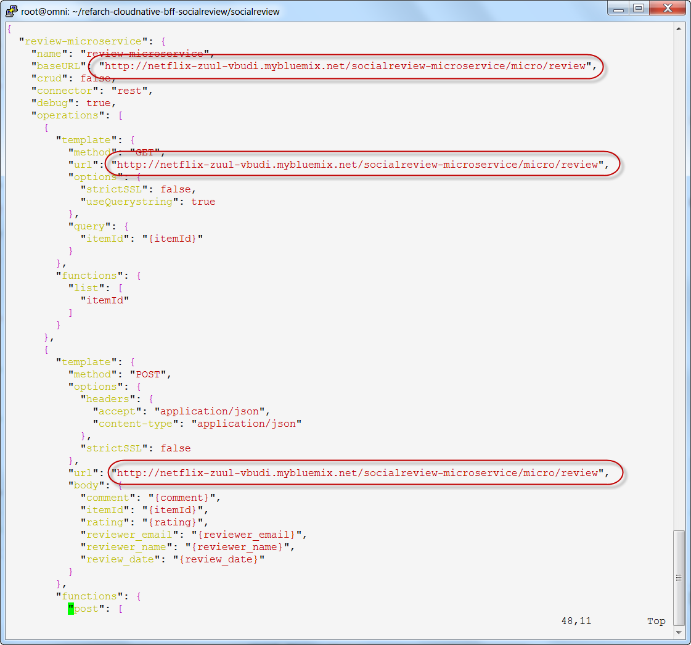
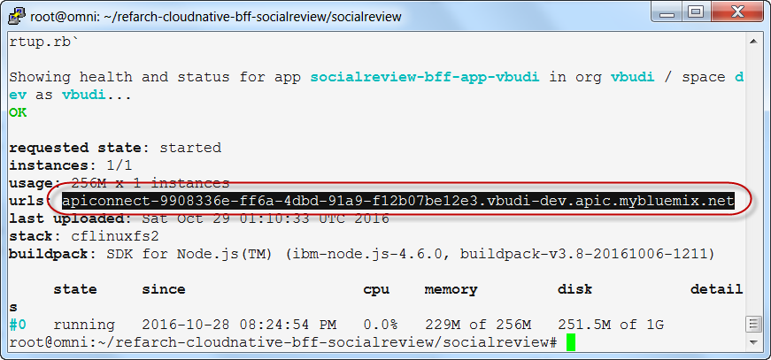

# Unit 5: Working with the Social Review BFF API Connect Loopback Application

The BFF for the social review application is implemented as an API Connect loopback application. The steps in this unit are based on `https://github.com/ibm-cloud-architecture/refarch-cloudnative-bff-socialreview`.

## Exercise 1: Provisioning the API Connect Service

The following steps are needed to set up the API Connect service on Bluemix. 

1. Create the API Connect service

        cf create-service APIConnect Essentials apic-refarch-<SUFFIX>
2. Login to the Bluemix interface. In the dashboard click on the apic-refarch-<SUFFIX> service. This will create the default API Connect organization, which is in the format of `<org>-<space>`.

## Exercise 2: Publishing the Social Review BFF Application Structure

In this exercise, you deploy the Social Review BFF as a Cloud Foundry application. This application acts as a front end for the Social Review application, which as already been deployed for you as a shared service.

1. Go to the Social Review application directory and edit the `server/datasources.json` file
        
        cd ~/refarch-cloudnative-bff-socialreview/socialreview
        vi server/datasources.json

2. Change each of the circled definitions shown below to the following:
        
        "https://socialreviewservice-garage.mybluemix.net/micro/review", 

3. Login to the API Connect command line interface.

        cd ~/refarch-cloudnative-bff-socialreview/socialreview
        apic login -s <APIC SERVER> -u <IBMid> -p <IBMpw>
        
   Your `<APIC SERVER>` is `us.apiconnect.ibmcloud.com`. Your `<IBMid>` is your Bluemix user id. Your `<IBMpw>` is your Bluemix password.
  
4. Check your organization name.
 
        apic orgs -s  us.apiconnect.ibmcloud.com 

5. Configure your application to be published. The example shown is for the North America region. For the `<BluemixOrg>` parameter, you need to be aware of this formatting requirement. Your Bluemix default organization will typically be in the form of your email id. For this command, the format of `<BluemixOrg>` must be without any @ signs or . (periods). For example, if your Bluemix organization is vbudi@us.ibm.com, the `<BluemixOrg>` parameter should be `vbudiusibmcom`. For the `<BluemixSpace>` parameter, it is OK to include any hyphens that may be in the name of your Bluemix space. Use the results of the `apic orgs` command in the previous step to see the correct format of your organization and space for the following API Connect command. Make sure you scroll to the right to see the entire command.

        apic config:set app=apic-app://us.apiconnect.ibmcloud.com/orgs/<BluemixOrg>-<BluemixSpace>/apps/socialreview-bff-app-<SUFFIX>

6. Publish the social review BFF application. This deploys it as a Cloud Foundry application in Bluemix.

        apic apps:publish

6. Bind your BFF application to the autoscale service that you created earlier for the Inventory BFF application. Then restage the Social Review BFF application. 

        cf bs socialreview-bff-app-<SUFFIX> cloudnative-autoscale-<SUFFIX>
        cf restage socialreview-bff-app-<SUFFIX>

7 Store the launched URL string, see the following image:

    - URL: ________________________________________________________

