# Unit 6: Registering Application APIs to API Connect 

API definitions must be registered to API Connect. After that, they can be used by applications. This unit guides you through the steps of defining a catalog, applications and APIs. The descriptions are based on those in `https://github.com/ibm-cloud-architecture/refarch-cloudnative-api`.

## Exercise 1: Initializing the API Connect Catalog

1. Open the API Connect dashboard by clicking on the link for `apic-refarch-<SUFFIX>` under `All Services` in your Bluemix Dashboard. In API Connect, select Dashboard from the top-left menu. 
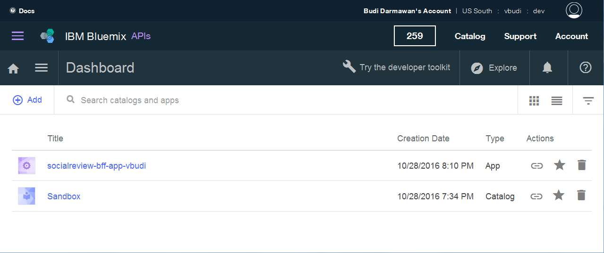

2. Select  > __Dashboard__. 

2. Create a new catalog. Select __+Add > Catalog__.
 
     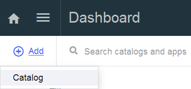

3. For the catalog name, specify `BlueCompute-<SUFFIX>`. Put your catalog name in the `Display Name` field. The `Name` field will fill in automatically with a lower case version of your Display Name.

    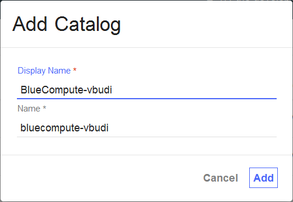

4. Go into the `BlueCompute-<SUFFIX>` catalog and select __Settings > Portal__ . Then select the `IBM Developer Portal` option.

    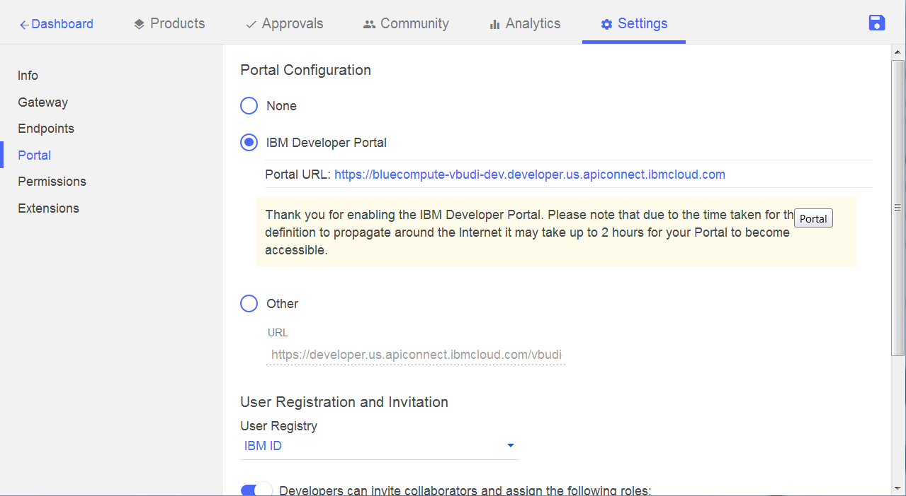

5. Save your setting by clicking the disk icon in the upper-right corner. Notice the URL for the developer portal. It will be available in a few minutes. You will receive an email when your developer portal is available. Wait until you receive that email before you proceed to the next exercise.

## Exercise 2: Working with the Developer Portal

1. After you receive the email that your Developer Portal is ready, click the link to the API Connect Developer Portal URL.
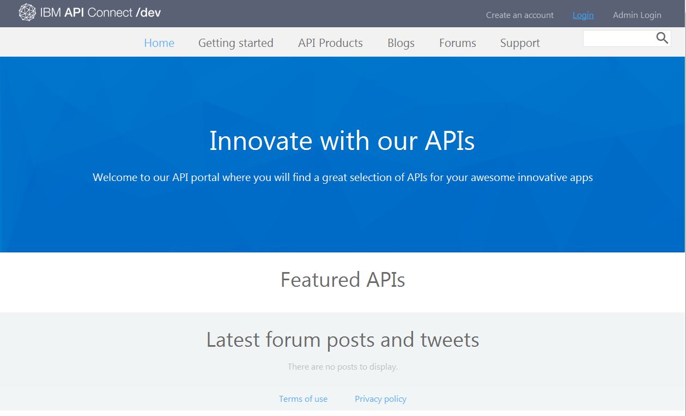

2. Click on the `Login` link in the upper right corner. It will automatically log you in based on Single Sign on with your IBM id. As this is the first time you are logging in, you are asked to provide an API Connect organization. Specify the organization in the same format as you used on the API Connect command line earlier for `<ORG>-<SPACE>`. For example, `vbudiusibmcom-cloudnative-dev`. Click `Submit`. 
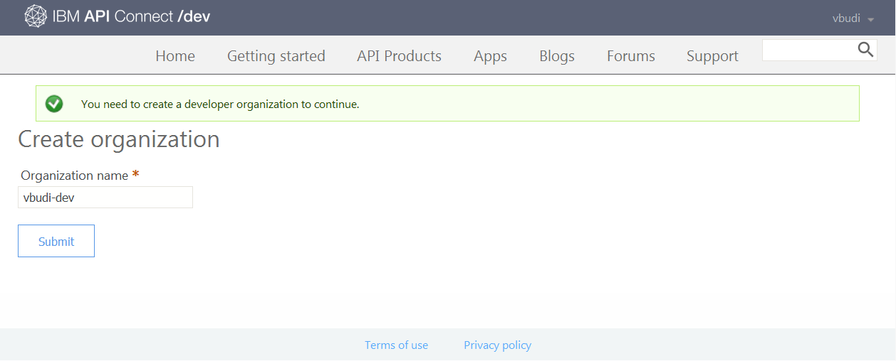

3. Click on the __Apps__ link at the top of the screen. Click __+Create new App__. Specify the following:
   
   - Title: `BlueCompute-app-<SUFFIX>` 
   - Redirect URL: `org.apic://example.com`
   - Click __Submit__
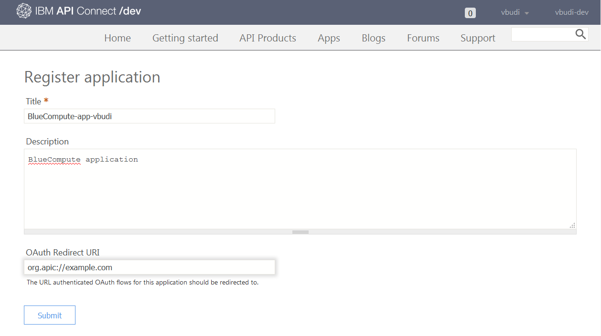

4. The Client ID must be saved because client applications will use this value to authenticate to the APi server. Click the corresponding "Show" checkboxes to see these values in test. Then copy and paste them to a text file where you can have them available.
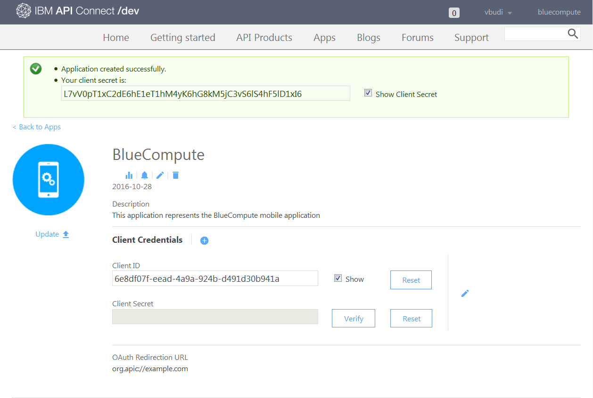
   - Client ID: _______________________________________

5. Now that the developer portal has been defined, you can start defining the APIs. You will subscribe the `BlueCompute-app-<SUFFIX>` application to these APIs later. Leave your developer portal screen logged in because you will come back to it later.

## Exercise 3: Defining the APIs

1. We will first define the inventory API. The inventory API must be defined with the proper BFF host address.  To do this, edit the `~/refarch-cloudnative-api/inventory/inventory.yaml` file. Change the definition for the following field:
   - x-ibm-configuration.properties.TARGET_HOST.value: ____________________________________
    
    Update the field with the URL to your Inventory BFF application `http://inventory-bff-app-<SUFFIX>.mybluemix.net` and save the file.
       
2. To define the Inventory API, enter the following commands:

        cd ~/refarch-cloudnative-api/inventory
        apic login -s us.apiconnect.ibmcloud.com -u <IBMid> -p <IBMpw>
        apic config:set catalog=apic-catalog://us.apiconnect.ibmcloud.com/orgs/<ORG>-<SPACE>/catalogs/bluecompute-<SUFFIX>
        apic publish inventory-product_0.0.1.yaml
    
3. Next we will define the Social Review API. View the file
    `~/refarch-cloudnative-bff-socialreview/socialreview/definitions/socialreview-product.yaml`.

   - How many sets of APIs does this definition contain? ______
        __Hint__: see the references under the apis.

4. In the same directory, edit the `socialreview.yaml` file. You will update the following parameter definitions: 
   - securityDefinitions.apic-oauth-provider.authorizationUrl _____________
   - x-ibm-configuration.properties.TARGET_HOST.value: ____________________________________

   Update the `securityDefinitions.apic-oauth-provider.authorizationUrl` field to customize it for your API Connect organization and catalog, and the `x-ibm-configuration.properties.TARGET_HOST.value` with the API Connect URL to your Social Review BFF application you got when you published it. 
   
	   Your `securityDefinitions.apic-oauth-provider.authorizationUrl` field should be set to point to your API Connect organization, space and catalog. Remember that the command `apic orgs -s -us.apiconnect.ibmcloud.com` will return your API Connect organization and space in the correct format if you have forgotten it:
	   
	   `"https://api.us.apiconnect.ibmcloud.com/<ORG>-<SPACE>/bluecompute-<SUFFIX>/oauth20/authorize"`
	
	   Your `x-ibm-configuration.properties.TARGET_HOST.value` field should be set to the API Connect URL to your Social Review BFF application you got when you published it. It will look something like this:
	   
	   `https://apiconnect-08e09dbb-8116-4765-9197-eb8d9172170f.<ORG>-<SPACE>.apic.mybluemix.net/`
	   
	   Save the file.

6. To define the Social Review API, enter the following commands:

        cd ~/refarch-cloudnative-bff-socialreview/socialreview/definitions
        apic login -s us.apiconnect.ibmcloud.com -u <IBMid> -p <IBMpw>
        apic config:set catalog=apic-catalog://us.apiconnect.ibmcloud.com/orgs/<ORG>-<SPACE>/catalogs/bluecompute-<SUFFIX>
        apic publish socialreview-product.yaml

## Exercise 4: Subscribing the API products to the API application in the Catalog

Go back to your developer portal at `https://bluecompute-<SUFFIX>-<ORG>-<SPACE>.developer.us.apiconnect.ibmcloud.com/`

1. Click on __API Products__ in the menu bar to check for published APIs. 
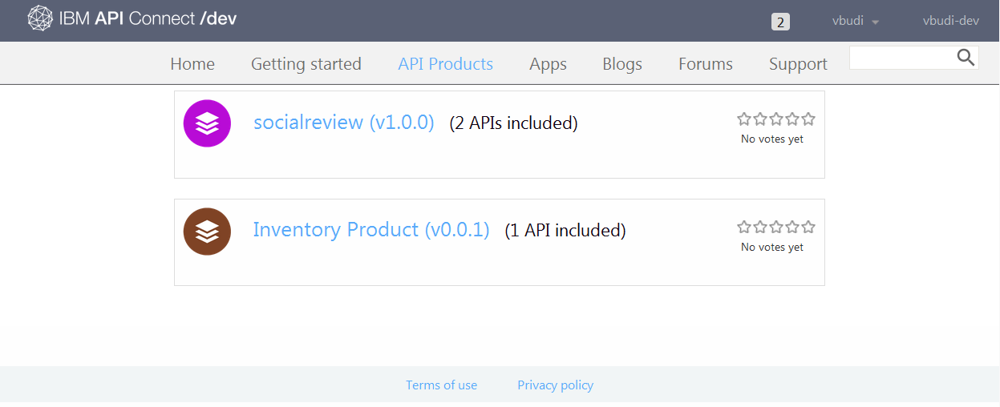

2. Select the Inventory Product API.
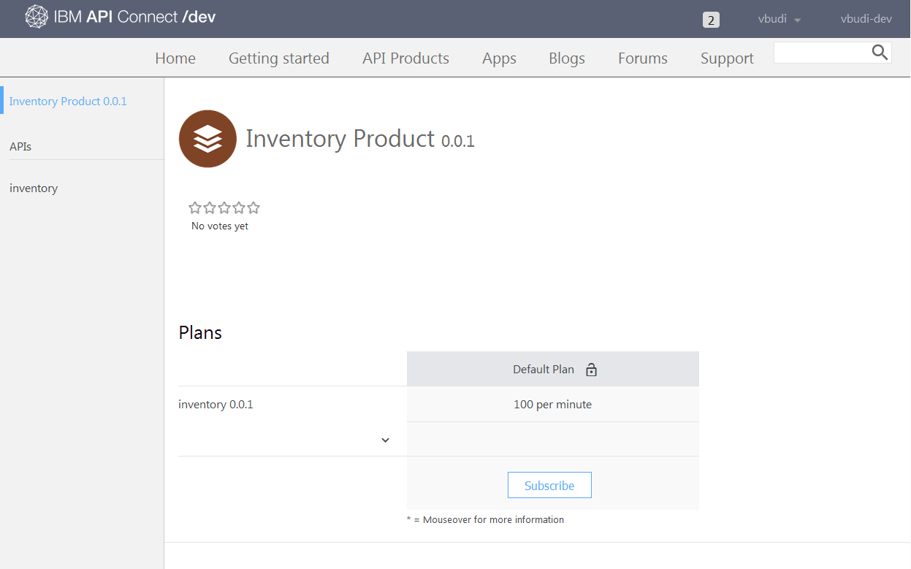

3. Select the __Subscribe__ button, choose your application (BlueCompute-app-<SUFFIX>) and click __Subscribe__.
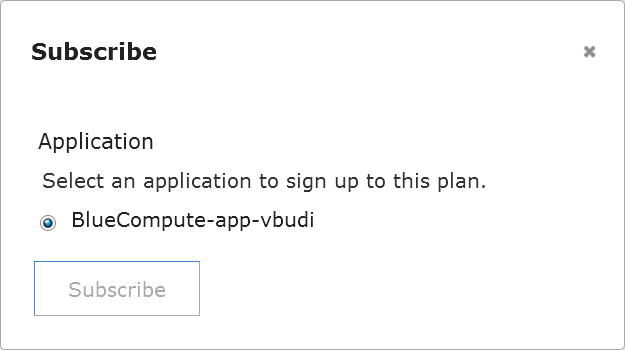

4. Back to the API Products screen, select socialreview and subscribe it to BlueCompute-app-<SUFFIX> too.
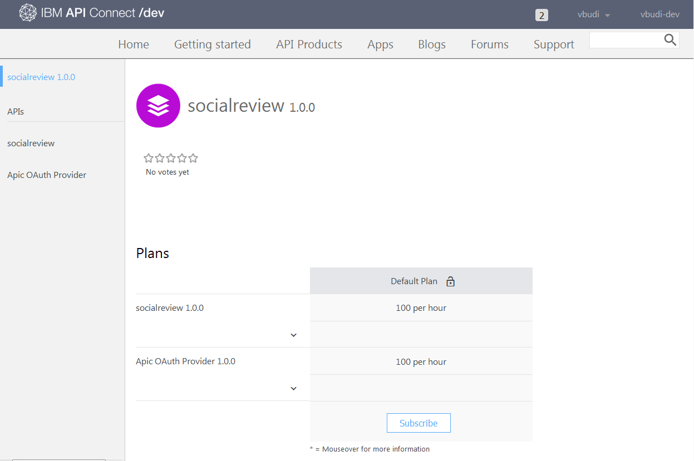

5. Click on the __Apps__ link in the menu bar. Go into the `BlueCompute-app-<SUFFIX>` application to verify that it has the correct subscriptions.
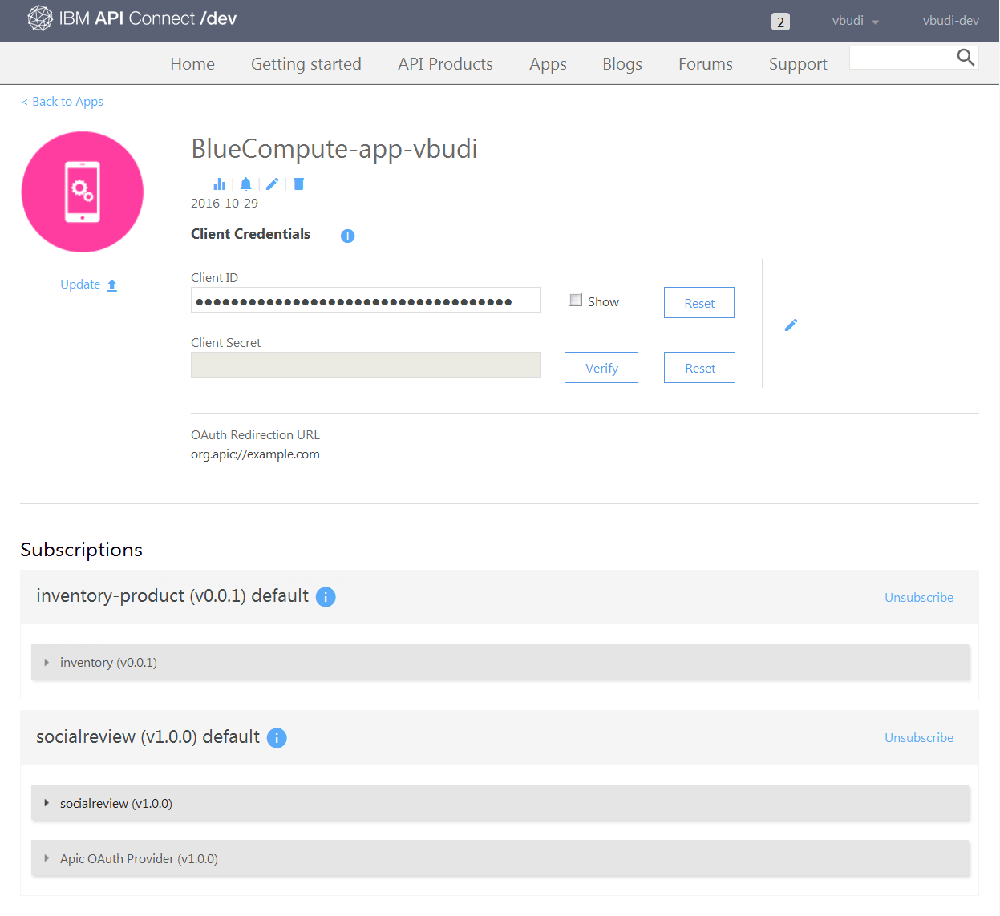

6. You can now log out from the developer portal (drop down from your ID and select __Log out__).

