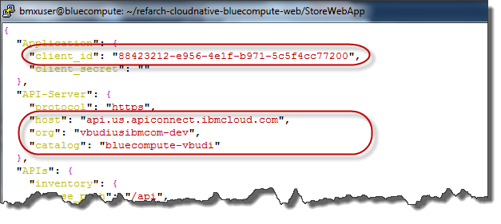
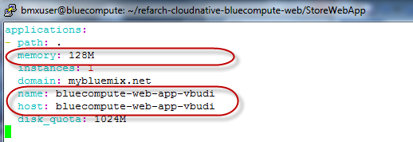
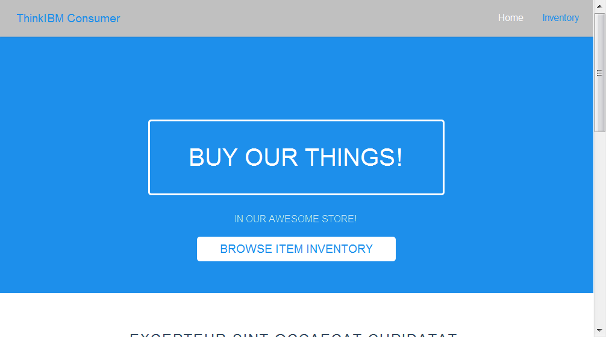
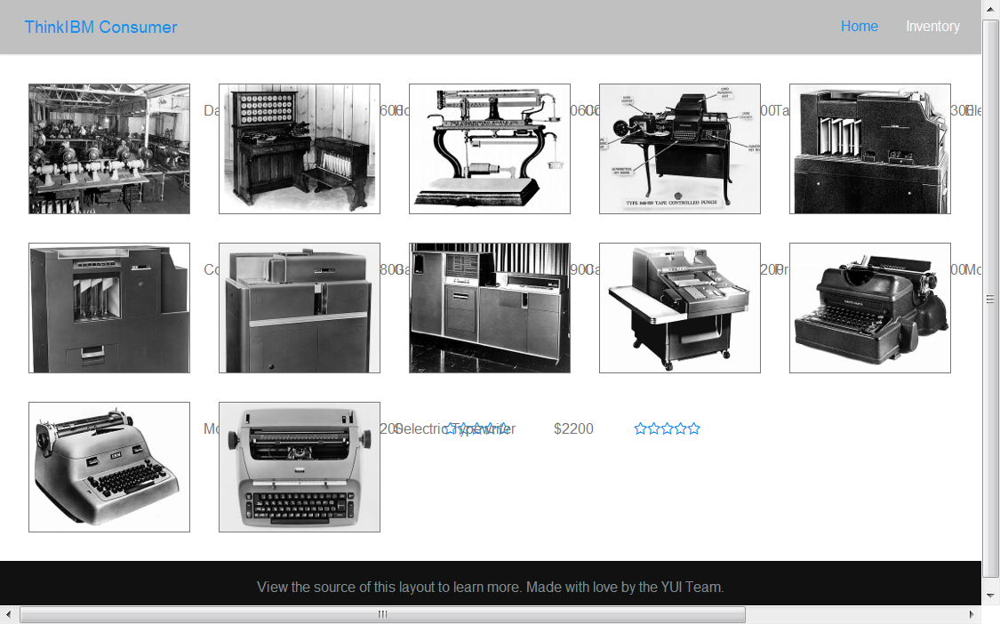
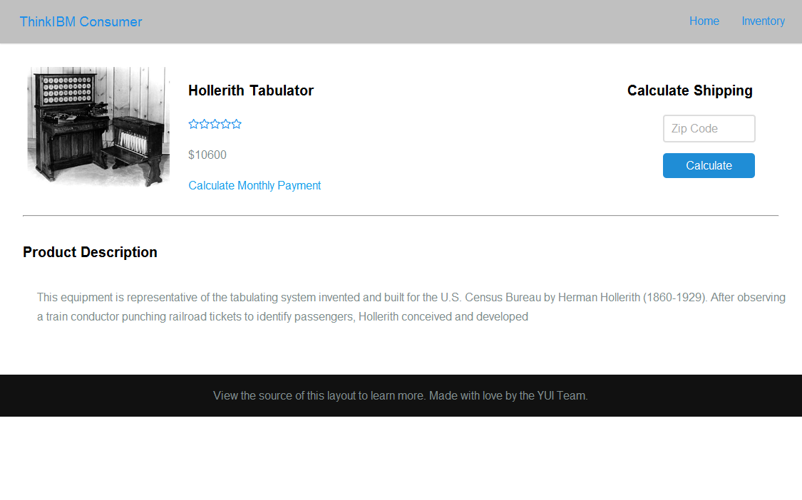

# Unit 7: Deploying a Node.js Web Application for BlueCompute

You will now deploy the Web application that integrates the BlueCompute application components. This web application runs as a Node.js Cloud Foundry application in Bluemix. The instructions here are based on the instructions in: `https://github.com/ibm-cloud-architecture/refarch-cloudnative-bluecompute-web`.

## Exercise 1: Deploying the BlueCompute Web Application

To configure and deploy the BlueCompute web application, do these steps:

1. Change to the directory for the BlueCompute web application.
```
cd ~/refarch-cloudnative-bluecompute-web/StoreWebApp
```

2. The API Connect properties for the BlueCompute web application are stored in the `config/default.json` file. Edit this file and customize the following fields to match your client_id, API Connect host, API Connect organization, and catalog.
```
```
 

2. Update the deployment manifest for Bluemix in the `manifest.yml` file. Change the memory requirement to 128M and add a suffix for the name and host to match yours.
```
```


3. Deploy the web application to Bluemix

        cd ~/refarch-cloudnative-bluecompute-web/StoreWebApp
        cf push


## Exercise 2: Testing the BlueCompute Web application

Now it is time to test the BlueCompute Web application. This application is designed to format well in the Safari browser. It should work regardless of the browser you are using, but you might have some formatting differences.

1. Open the main page: `http://bluecompute-web-app-<SUFFIX>.mybluemix.net`


2. From the main page, click __BROWSE ITEM INVENTORY__. This brings you to the list page, with all the items displayed. 


3. From the item list page, click on a single item. This brings you to the item detail page.


4. At the time of writing this lab, the web application does not provide any additional functionality than browsing the inventory. Further capabilities are provided in the mobile application.
