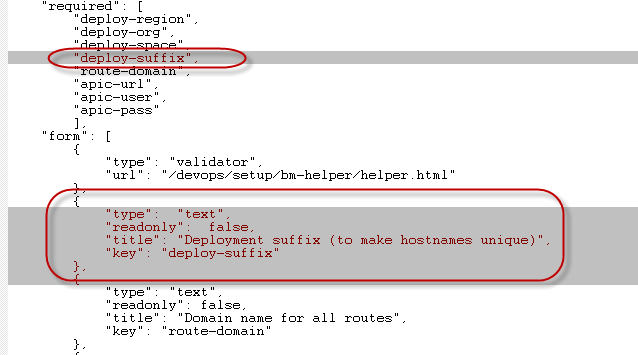
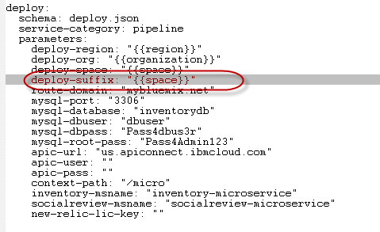

# Unit 9: Using Toolchain for DevOps

To use the toolchain in DevOps, you must have a github account (public github). As you must fork the existing DevOps repo to modify some of the feature (the modification are needed for the lab environment to ensure that each student can have a unique entity names) and then load the ToolChain from the repo.  

Also to perform this exercise, it is imperative that you already remove all your artifacts from lab 1 to 8. You must delete the mssql container, all container groups, all applications and your services (_except_ your API Connect)

## Exercise 1: Defining toolchain

These are the steps:

1. Fork the existing repo from `https://github.com/ibm-cloud-architecture/refarch-cloudnative-devops`. This will create a repo called `https://github.com/<your github id>/refarch-cloudnative-devops`.

2. Modify the file `.bluemix/deploy.json` to add a parameter called deploy-suffix. Save the file.

3. Modify the file `.bluemix/toolchain.yml` to add the suffix argument value for the toolchain parameter. 

4. Still in the `.bluemix/toolchain.yml` change all `-{{deploy.parameters.deploy-space}}` into `-{{deploy.parameters.deploy-suffix}}`. Note that there is a hyphen in the search and replace strings. Save the file.

4. Load the toolchain, make sure you are already log in to the bluemix.net Web page. Open the following URL:

        https://new-console.ng.bluemix.net/devops/setup/deploy/?repository=https%3A//github.com/<your git id>/refarch-cloudnative-devops.git

5. Your toolchain will be provisioned with the page similar to:
 

## Exercise 2: Understanding deployment pipeline

The initial toolchain that you deploy only consists of GIT repositories (clone of the originals) and the deployment pipelines, which represents the steps that you have performed manually in all these labs. Now you just have to do this in an automated way (the easy way); however the gruesome experience is needed for you to understand the concept.

This is your completed toolchain:

1. Deploy eureka: Run pipeline-netflix-eureka
2. Deploy zuul: Run pipeline-netflix-zuul
3. Deploy inventory microservice: Run pipeline-inventorydb-mysql and pipeline-micro-inventory
4. Deploy social review microservice: Run pipeline-micro-socialreview
5. Deploy inventory BFF: Run pipeline-bff-inventory
6. Deploy social review BFF: Run pipeline-bff-socialreview
7. Deploy inventory API: Run pipeline-api
8. Deploy BlueCompute Web application: this application is deployed manually as explained in Unit 7.

## Exercise 3: Testing and Notification

Now that you have these deployment are performed, you already have a working application. Any changes that you perform and commit to the cloned GIT repo will trigger a re-deployment of the component.

1. Add the editor piece for each of the GIT repo.
2. Perform modification for the inventory BFF, similar to what you did in Unit 4, which fixes the inventory BFF crashes. Test the inventory BFF
3. Perform the modification on the BlueCompute Web application to fix the image URL as discussed in Unit 7. Test the result.
4. Slack? 
5. Sauce lab testing?
6. Modify pipeline with TEST stages?